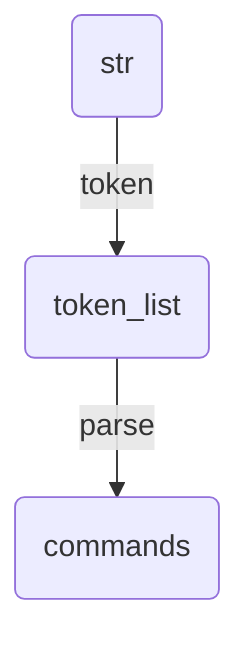
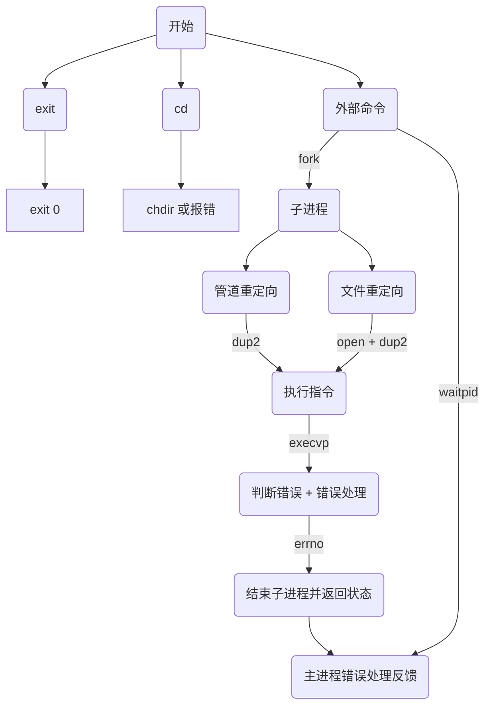
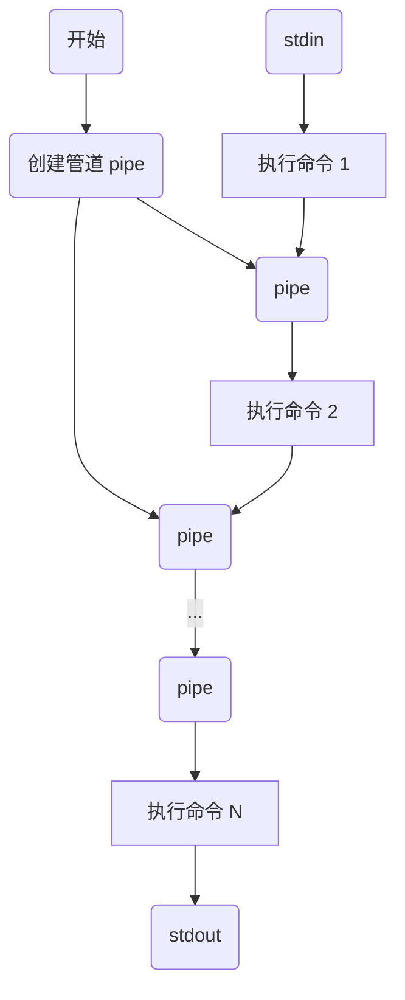

# 项目结构

```
|- err.h 错误处理宏定义
|- def.h 参数宏定义
|- main.c 主程序
|- ps.c 输出路径和命令提示符
|- parse.c 解析输入
|- cmd.c 运行命令
```

# 使用方式

```shell
$ cd myshell && make
$ ./myshell
```

<div style="page-break-after:always"></div>

# 功能概述

## 路径提示

对当前所在的路径进行提示，用绿色表示路径，用 `$` 分隔命令和路径。

如图所示，还支持路径折叠（即将 `HOME` 目录折叠成 `~`）。


<div style="page-break-after:always"></div>

## 多参数支持


<div style="page-break-after:always"></div>

## 字符转义

找到所有 `"#include "*.h"`


<div style="page-break-after:always"></div>

## 管道支持

统计 c 文件数量：


<div style="page-break-after:always"></div>

## 文件重定向


<div style="page-break-after:always"></div>

## 错误提示


<div style="page-break-after:always"></div>

## 内部命令 cd


<div style="page-break-after:always"></div>

## 内部命令 exit：退出


<div style="page-break-after:always"></div>

# 系统调用

## ps.c

- `getcwd()`：获取所在路径
- `getenv()`：获取 `$HOME` 环境变量，用于路径折叠

## cmd.c

- `chdir()`：进入路径，用于 `cd` 命令
- `exit()`：终止子进程
- `open()`/`close()`：打开/关闭文件描述符，用于文件重定向
- `dup2()`：复制文件描述符，用于文件重定向
- `execvp()`：调用命令
- `waitpid`：主进程等待子进程结束并获取返回值

<div style="page-break-after:always"></div>

## 流程图

### 解析输入 (parse)



<div style="page-break-after:always"></div>

### 执行单个命令



<div style="page-break-after:always"></div>

## 组合多个命令（管道）



<div style="page-break-after:always"></div>

# 源代码

项目开源在 [roife/Myshell](http://github.com/roife/myshell)。